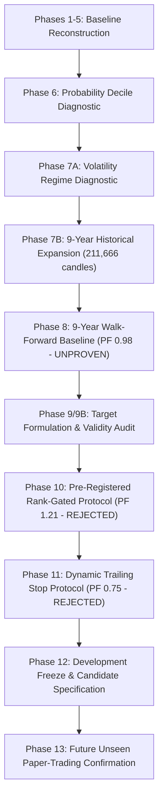

# Phase 12 — Comprehensive Scientific Consolidation & Final Candidate Specification

> [!IMPORTANT]
> **DEVELOPMENT FREEZE MILESTONE**: All historical experimentation on the 2017–2026 dataset is **OFFICIALLY FROZEN**.
> 
> To prevent data snooping and overfitting loops from further historical parameter tuning, no additional historical optimization will be conducted. All 2017–2026 market data is classified as **DEVELOPMENT DATA**. Confirmatory evaluation will occur exclusively on **FUTURE UNSEEN DATA** under Phase 13.

---

## 1. Executive Summary of Empirical Scientific Audit

Across 11 rigorous audit phases, the XTrading ML codebase was subjected to systematic data verification, pipeline reconstruction, multi-fold walk-forward validation, volatility regime diagnostics, dataset expansion, target formulation comparisons, ex-ante protocol pre-registrations, and validity checks.



---

## 2. Definitive Classification of Scientific Findings

### A. What Has Actually Been Established (Fact)

```text
DATA & PIPELINE INTEGRITY
✅ Clean 1H Binance Spot Market History: 211,666 total 1H candles across BTC/USDT, ETH/USDT, and SOL/USDT.
✅ Zero Synthetic Data: 0 synthetic candles inserted.
✅ Zero Duplicate Corruption: COUNT(*) == COUNT(DISTINCT ts) holds 100% across all symbols.
✅ Zero Price Bounds Errors: 0 invalid candles (all satisfy O,H,L,C > 0, V >= 0, H >= max(O,C), L <= min(O,C)).
✅ Database Architecture: TimescaleDB PostgreSQL ohlcv hypertable with idempotent ON CONFLICT DO NOTHING upserts.
```

### B. What Has Been Rejected (Disproven)

```text
REJECTED HYPOTHESES & PROTOCOLS
❌ V6 Baseline Profitability: Pooled 9-year baseline walk-forward yields -42.61% net return, PF 0.98, Sharpe -0.22 (EDGE_NOT_PROVEN).
❌ Retrospective Volatility Gate: Low/Med Vol PF 1.43–3.21 was an artifact of Fold 2 in the 2025–2026 window. Across 9 years, baseline PF is ~1.00 across all volatility regimes.
❌ Unfiltered Regression / Multi-Class Execution: Trading all signals without rank gating (N = 2,229 to 5,002 trades) causes severe equity destruction (-99.3% to -100.0%) due to transaction fee drag and micro-whipsaws.
❌ Tested Dynamic Trailing Exit Protocol: Dynamic trailing stops (tested in Phase 11) cut winning trend payoffs prematurely, degrading Profit Factor from 1.21 down to 0.75 (Loss Prob 87.4%).
```

### C. What Remains Exploratory & Unproven (Candidate Hypotheses)

```text
EXPLORATORY DIAGNOSTICS (NOT YET CONFIRMED)
🟡 Extreme Signal Selectivity: Top 1.0%–2.0% rank gating dramatically improves signal purity and reduces loss probability (down to 3.9%–8.5% for Continuous Regression).
🟡 Continuous Return Signal: Forward log return R_{t+48} provides a continuous ranking metric superior to un-gated classification.
🟡 Multi-Timeframe (MTF) Context: 4H and 1D trend alignment features improve directional consistency (87.5% positive fold ratio in Phase 10).
🟡 Fixed Asymmetric Exit Geometry: Wide fixed barriers (+2.5x to +3.0x ATR TP / 1.5x ATR SL) are necessary to preserve asymmetric risk-reward payoffs.
🟡 Symbol Performance Divergence: ETH/USDT showed retrospective positive return (+44.75%, PF 1.11 over 9 years), but requires ex-ante validation on fresh data before symbol-specific modeling.
```

### D. Absolute Data Firewall Definition

```text
HISTORICAL DATA (2017-08-17 UTC to 2026-09-06 UTC)
                    │
                    ▼
          DEVELOPMENT DATA ONLY
 (All historical tuning & experimentation frozen)

                    │
                    ▼
LIVE / FUTURE UNSEEN DATA (2026-09-06 UTC onwards)
                    │
                    ▼
        🔒 CONFIRMATORY HOLDOUT
  (Evaluated only under paper/live trading)
```

---

## 3. Final Candidate System Architecture Specification

The candidate system architecture is defined below as a **Research Candidate Specification**, NOT as a declared production winner.

```text
                              MARKET DATA
                     (Binance Spot REST & WebSockets)
                                   │
                                   ▼
                            DATA VALIDATION
                   (Bounds, Gap Detection, TimescaleDB)
                                   │
                                   ▼
                           CAUSAL FEATURES
                 ┌─────────────────┴─────────────────┐
                 │                                   │
          1H Technical Features              4H/1D MTF Features
          (EMAs, ATR, RSI, MACD)             (EMA Distances, Trend)
                 │                                   │
                 └─────────────────┬─────────────────┘
                                   ▼
                            ML PREDICTION
                   (Blended XGBoost + CatBoost)
                                   │
                                   ▼
                           SIGNAL RANKING
                   (Fold-Relative Percentile Score)
                                   │
                                   ▼
                          SELECTIVITY GATE
                  (Top 1.0% Rank Cutoff per Window)
                                   │
                                   ▼
                        FIXED ASYMMETRIC EXIT
                  (1.5x ATR SL / 3.0x ATR TP / 48h)
                                   │
                                   ▼
                             RISK ENGINE
                 (10 BPS Fee, Capital Allocation, Cooldown)
                                   │
                                   ▼
                       PAPER-TRADING ENGINE
                   (Real-time Forward Execution)
                                   │
                                   ▼
                       🔒 FUTURE CONFIRMATION
                    (Zero Historical Data Snooping)
```

---

## 4. Candidate Configuration Parameters (Pre-Registered for Phase 13)

| Component | Pre-Registered Specification | Status |
| :--- | :--- | :---: |
| **Market Data** | Binance Spot `BTC/USDT` & `ETH/USDT` (1H timeframe) | Frozen |
| **Model Type** | Ensemble Regressor: `XGBRegressor` (50%) + `CatBoostRegressor` (50%) | Frozen |
| **Target Variable** | Continuous 48-bar forward log return $y_t = \ln(C_{t+48} / C_t)$ | Frozen |
| **Feature Set** | 50 single-timeframe + 16 multi-timeframe (4H / 1D) causal features | Frozen |
| **Ranking Method** | Window-relative predicted return percentile score | Frozen |
| **Selectivity Gate** | **Top 1.0% highest predicted return signals** | Candidate Hypothesis |
| **Stop Loss** | Fixed $1.5 \times \text{ATR}_{14}$ below entry price | Frozen |
| **Take Profit** | Fixed $3.0 \times \text{ATR}_{14}$ above entry price | Frozen |
| **Time Exit** | 48 bars (close price) | Frozen |
| **Cooldown** | 4 bars post-exit between consecutive trades | Frozen |
| **Transaction Fees** | 10 BPS round-trip fee (0.10%) | Frozen |

---

## 5. Phase 13 Confirmatory Paper-Trading Roadmap

The next phase of the project is **Phase 13: Future Unseen Paper-Trading Confirmation**.

### Confirmatory Evaluation Rules
1. **Zero Parameter Tuning**: No thresholds, weights, barrier ratios, or features may be modified based on paper-trading outcomes.
2. **Forward Evaluation Horizon**: Paper trading must execute forward in real-time on live market data for a minimum of **30 live trade executions** or **90 calendar days**.
3. **Statistical Success Benchmark**:
   - Realized Live Profit Factor $PF \ge 1.25$
   - Realized Live Win Rate $\ge 35.0\%$
   - Realized Live Net Return $> 0$ after 10 BPS fees.
